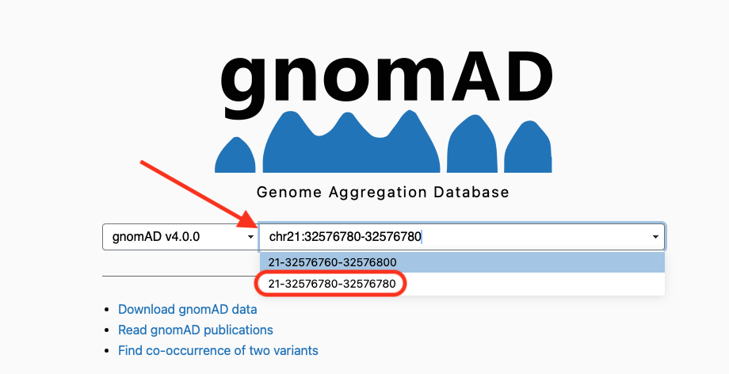
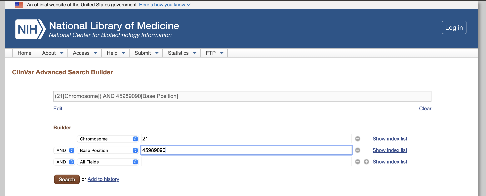

# Variant Interpretation

Once variants have been called, the following steps depend on the type of study and the experimental design.
For large population studies, like case-control association analyses, an appropriate large-scale statistical approach will be chosen and different statistical or analytical tools will be used to carry out the tertiary analyses.

When only a few individuals are involved, and in particular in clinical contexts, the goal will be to interpret the findings in light of different sources of information and pinpoint a causative variant for the investigated phenotype.

## Overview

When variants have been called, and a diagnosis is necessary, investigators will need to combine:

-   the predictions resulting from annotations like the one we carried out
-   biological and clinical information

with the goal of narrowing the search space and reducing the number of variants to be inspected.
This approach is summarised in the diagram below:

<figure class="excalidraw">
--8<-- "docs/dna-vc/img/interpretation.excalidraw.svg"
</figure>

Once the list of variants has been reduced, more in-depth analyses of the reported cases and the genomic region in existing databases might be useful to reach a conclusion.

## Finding Causative Variants

Some of these steps might be carried out via software. For this tutorial however, we chose to perform these steps one by one in order to get a better view of the rationale behind this approach.

We will start by looking at the annotated VCF, which is found at this location in our GitPod environment:

!!! question "Exercise"

    Move into the working directory containing the annotated VCF file:

    ```bash
    cd /workspace/gitpod/applied-training/dna-vc/annotation/haplotypecaller/joint_variant_calling
    ```

Here, we should verify in which order the two samples we used for this analysis have been written in the VCF file. We can do that by grepping the column names row of the file, and printing at screen the fields from 10th onwards, i.e. the sample columns:

!!! question "Exercise"

    Verify in which order the two samples we used using `zcat`, `grep` and `cut`:

    ```bash
    zcat joint_germline_recalibrated_snpEff.ann.vcf.gz | grep "#CHROM" | cut -f 10-
    ```

This should return the following output showing that case variants have been written in field 10th and control variants in field 11th.
:

```bash
case_case       control_control
```

Next, in this educational scenario we might assume that an affected individual (case) will carry at least one alternative allele for the causative variant, while the control individual will be a homozygous for the reference.
With this assumption in mind, and a bit of one-liner code, we could first filter the homozygous for the alternative allele in our case, and then the heterozygous.

In this first one, we can use the following code:

!!! question "Exercise"

    Filter the homozygous for the alternative allele in the case sample using `zcat`, `grep` and `perl`:

    ```bash
    zcat joint_germline_recalibrated_snpEff.ann.vcf.gz | grep PASS | grep HIGH | perl -nae 'if($F[10]=~/0\/0/ && $F[9]=~/1\/1/){print $_;}'
    ```

This should return the following variant.

```console
chr21   32576780        rs541034925     A       AC      332.43  PASS    AC=2;AF=0.5;AN=4;DB;DP=94;ExcessHet=0;FS=0;MLEAC=2;MLEAF=0.5;MQ=60;POSITIVE_TRAIN_SITE;QD=33.24;SOR=3.258;VQSLOD=953355.11;culprit=FS;ANN=AC|frameshift_variant|HIGH|TCP10L|ENSG00000242220|transcript|ENST00000300258.8|protein_coding|5/5|c.641dupG|p.Val215fs|745/3805|641/648|214/215||,AC|frameshift_variant|HIGH|CFAP298-TCP10L|ENSG00000265590|transcript|ENST00000673807.1|protein_coding|8/8|c.1163dupG|p.Val389fs|1785/4781|1163/1170|388/389||  GT:AD:DP:GQ:PL  1/1:0,10:10:30:348,30,0 0/0:81,0:81:99:0,119,1600
```

Now we can search for this variant in the [gnomAD database](https://gnomad.broadinstitute.org), which hosts variants and genomic information from sequencing data of almost one million individuals (see [v4 release](https://gnomad.broadinstitute.org/news/2023-11-gnomad-v4-0/)).

In order to search for the variant we can type its coordinates in the search field and choose the proposed variant corresponding to the exact position we need. See the figure below:



the resulting [variant data](https://gnomad.broadinstitute.org/region/21-32576780-32576780?dataset=gnomad_r4) show that our variant is present, and that it's been described already in [ClinVar](https://www.ncbi.nlm.nih.gov/clinvar/), where the provided interpretation (Clinical Significance) is "Benign".

We can see the resulting table in the following image:


Quite importantly, the gnomAD database allows us to gather more information on the gene this variant occurs in. We can inspect the so called "constraint data", by clicking on the gene name and inspecting the "constraint" table on the top right of the page.


This information gives us a better view of the selective pressure variation on this gene might be subject to, and therefore inform our understanding of the potential impact of a loss of function variant in this location.

In this specific case however the gene is not under purifying selection neither for loss of function variants (LOEUF 0.89) nor for missense ones.

We can continue our analysis by looking at the heterozygous variants in our case, for which the control carries a reference homozygous, with the code:

!!! question "Exercise"

    Filter the heterozygous variants in the case sample using `zcat`, `grep` and `perl`:

    ```bash
    zcat joint_germline_recalibrated_snpEff.ann.vcf.gz | grep PASS | grep HIGH | perl -nae 'if($F[10]=~/0\/0/ && $F[9]=~/0\/1/){print $_;}'
    ```

This should return the following list of variants:

```console
chr21   44339194        rs769070783     T       C       57.91   PASS    AC=1;AF=0.25;AN=4;BaseQRankSum=-2.373;DB;DP=84;ExcessHet=0;FS=0;MLEAC=1;MLEAF=0.25;MQ=60;MQRankSum=0;POSITIVE_TRAIN_SITE;QD=3.41;ReadPosRankSum=-0.283;SOR=0.859;VQSLOD=198.85;culprit=FS;ANN=C|start_lost|HIGH|CFAP410|ENSG00000160226|transcript|ENST00000397956.7|protein_coding|1/7|c.1A>G|p.Met1?|200/1634|1/1128|1/375||,C|upstream_gene_variant|MODIFIER|ENSG00000232969|ENSG00000232969|transcript|ENST00000426029.1|pseudogene||n.-182T>C|||||182|,C|downstream_gene_variant|MODIFIER|ENSG00000184441|ENSG00000184441|transcript|ENST00000448927.1|pseudogene||n.*3343T>C|||||3343|;LOF=(CFAP410|ENSG00000160226|1|1.00)   GT:AD:DP:GQ:PL  0/1:8,9:17:66:66,0,71   0/0:67,0:67:99:0,118,999
chr21   44406660        rs139273180     C       T       35.91   PASS    AC=1;AF=0.25;AN=4;BaseQRankSum=-4.294;DB;DP=127;ExcessHet=0;FS=5.057;MLEAC=1;MLEAF=0.25;MQ=60;MQRankSum=0;POSITIVE_TRAIN_SITE;QD=0.51;ReadPosRankSum=0.526;SOR=1.09;VQSLOD=269.00;culprit=FS;ANN=T|stop_gained|HIGH|TRPM2|ENSG00000142185|transcript|ENST00000397932.6|protein_coding|19/33|c.2857C>T|p.Gln953*|2870/5216|2857/4662|953/1553||;LOF=(TRPM2|ENSG00000142185|1|1.00);NMD=(TRPM2|ENSG00000142185|1|1.00)       GT:AD:DP:GQ:PL  0/1:48,22:71:44:44,0,950        0/0:51,0:51:99:0,100,899
chr21   45989090        .       C       T       43.91   PASS    AC=1;AF=0.25;AN=4;BaseQRankSum=2.65;DP=89;ExcessHet=0;FS=4.359;MLEAC=1;MLEAF=0.25;MQ=60;MQRankSum=0;QD=2.58;ReadPosRankSum=-1.071;SOR=1.863;VQSLOD=240.19;culprit=FS;ANN=T|stop_gained|HIGH|COL6A1|ENSG00000142156|transcript|ENST00000361866.8|protein_coding|9/35|c.811C>T|p.Arg271*|892/4203|811/3087|271/1028||;LOF=(COL6A1|ENSG00000142156|1|1.00);NMD=(COL6A1|ENSG00000142156|1|1.00)        GT:AD:DP:GQ:PL  0/1:10,7:18:51:52,0,51  0/0:70,0:70:99:0,120,1800
```

If we search them one by one, we will see that one in particular occurs on a gene (COL6A1) which was previously reported as constrained for loss of function variants in the database version 2.1:


while the version 4.0 of the database, resulting from almost one million samples, reports the gene as _not_ constrained:


We can search for this variant in ClinVar by using an advanced search and limiting our search to both chromosome and base position, like indicated in figure below:



This will return two results: one deletion and one single nucleotide variant C>T corresponding to the one we called in the case individual:


If we click on the nomenclature of the variant we found, we will be able to access the data provided with the submission. In [this page](https://www.ncbi.nlm.nih.gov/clinvar/variation/497373/) we can see that multiple submitters have provided an interpretation for this nonsense mutation (2 stars).
Under the section "Submitted interpretations and evidence" we can gather additional data on the clinical information that led the submitters to classify the variant as "pathogenic".

## Conclusions

After narrowing down our search and inspecting genomic context and clinical information, we can conclude that the variant

```console
chr21   45989090        C       T       AC=1;AF=0.25;AN=4;BaseQRankSum=2.37;DP=86;ExcessHet=0;FS=0;MLEAC=1;MLEAF=0.25;MQ=60;MQRankSum=0;QD=2.99;ReadPosRankSum=-0.737;SOR=1.022;VQSLOD=9.09;culprit=QD;ANN=T|stop_gained|HIGH|COL6A1|ENSG00000142156|transcript|ENST00000361866.8|protein_coding|9/35|c.811C>T|p.Arg271*|892/4203|811/3087|271/1028||;LOF=(COL6A1|ENSG00000142156|1|1.00);NMD=(COL6A1|ENSG00000142156|1|1.00)     GT:AD:DP:GQ:PL       0/1:8,6:15:40:50,0,40   0/0:70,0:70:99:0,112,1494
```

is most likely the causative one, because it creates a premature stop in the COL6A1 gene, with loss of function variants on this gene known to be pathogenic.
