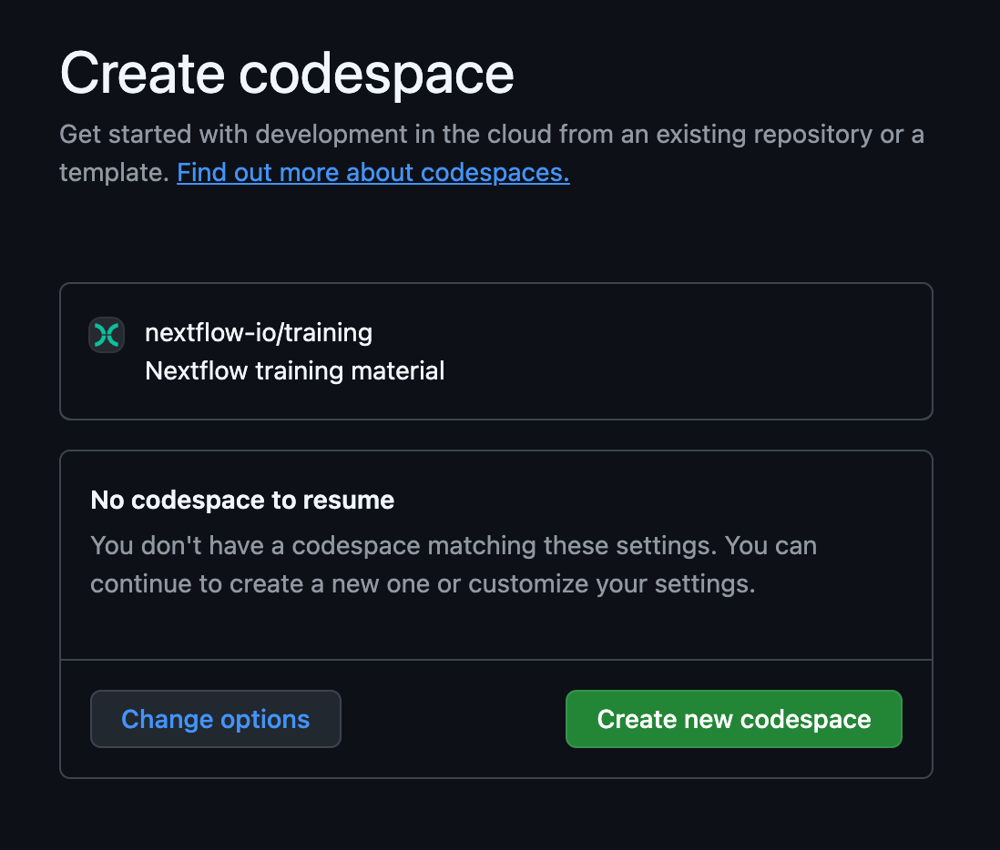
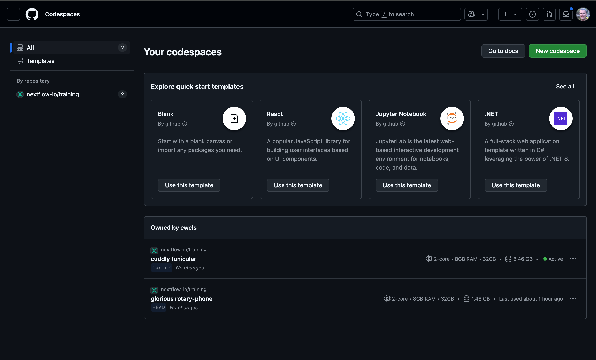
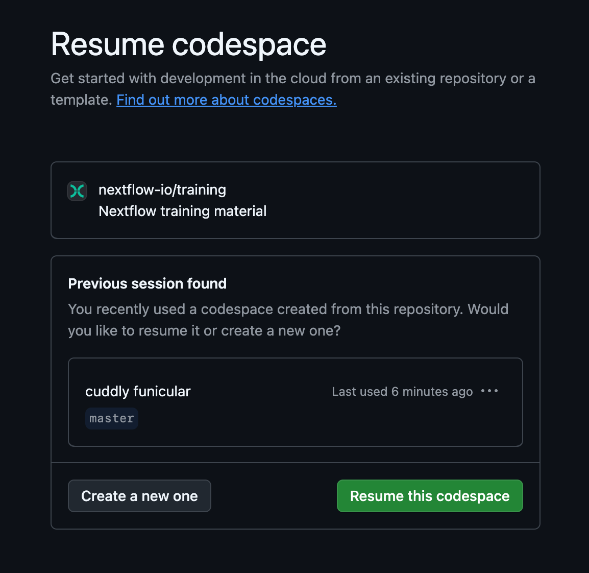

# GitHub Codespaces

GitHub Codespaces is a cloud development environment for teams to efficiently and securely develop software. It can improve your developer experience by coding in a cloud development environment.

## Creating a Gitpod account

You can create a free GitHub account from the [GitHub home page](https://github.com/).

## Running GitHub Codespaces

Once you are logged in to GitHub, open this link in your browser to open the training environment: <https://codespaces.new/nextflow-io/training?quickstart=1&ref=master>

Alternatively, you can click on the button below.

You should be presented with a page where you can create a new GitHub Codespace:

If you wish, you can click "Change options" to configure the machine used, though the defaults should be fine.

!!! warning

    Opening a new GitHub Codespaces environment for the first time can take several minutes.
    It's worth grabbing a cup of tea and checking your emails.

## Explore your GitHub Codespaces IDE

After GitHub Codespaces has loaded, you should see something similar to the following (which may in light mode depending on your account preferences):

This is the interface of the VSCode IDE, a popular code development application that we recommend using for Nextflow development.

- **The sidebar** allows you to customize your GitHub Codespaces environment and perform basic tasks (copy, paste, open files, search, git, etc.). You can click the explorer button to see which files are in this repository.
- **The terminal** allows you to run all the programs in the repository. For example, both `nextflow` and `docker` are installed and can be executed.
- **The file explorer** allows you to view and edit files. Clicking on a file in the explorer will open it within the main window.
- **The main editor** showing you a preview of the `README.md` file.

## Reopening a GitHub Codespaces session

Once you have created an envionrment, you can easily resume or restart it and continue from where you left off.

You can reopen an environment from <https://github.com/codespaces/>. Previous environments will be listed. Click a session to resume it.

If you have saved the URL for your previous Gitpod environment, you can simply open it in your browser.

Alternatively, click the same button that you used to create it in the first place:

You should see the previous session, the default option is to resume it:

## GitHub Codespaces billing

GitHub Codespaces gives you up to 15 GB-month storage per month, and 120 core-hours per month.
This is equivalent to around 60 hours of free environment runtime using the standard workspace (up to 2 cores, 8 GB RAM, and 32 GB storage).

GitHub Codespaces environments are configurable. You can create them with more resources, but this will use your free usage quicker and you will have fewer hours of access to this space.

GitHub Codespaces will time out after 30 minutes of inactivity and will save your changes for up to 2 weeks.

More information can be found in the GitHub docs:
[About billing for GitHub Codespaces](https://docs.github.com/en/billing/managing-billing-for-your-products/managing-billing-for-github-codespaces/about-billing-for-github-codespaces)

### Saving files from GitHub Codespaces to your local machine

To save any file from the explorer panel, right-click the file and select `Download`.
