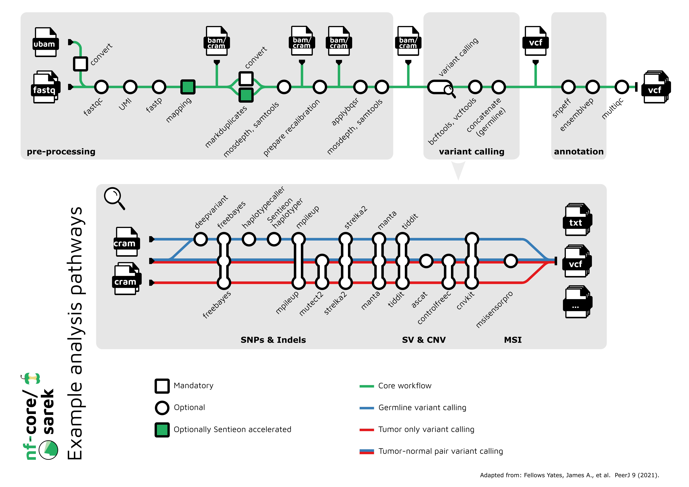

# Sarek: a Variant Calling Pipeline

In order to carry out a germline variant calling analysis we will use the nf-core pipeline [sarek](https://nf-co.re/sarek/3.3.2).

## Overview

The pipeline is organised following the three main analysis blocks we previously described: pre-processing, variant calling and annotation.



In each analysis block, the user can choose among a range of different options in terms of aligners, callers and software to carry out the annotation.
The analysis can also start from different steps, depending the input available and whether it has been partially processed already.

## Experimental Design

In order to choose the different options Sarek offers, the user should collect a few key elements of the experimental design before beginning the analysis.

### Library design

If the experiment used a capture (or targeted) strategy, the user will need to make sure the `bed` file with the target regions is available.
This file will be useful if the user wants to limit variant calling and annotation to those regions. 
In this case the file can be passed to Sarek command line using the `--intervals target.bed` parameter.
Should the sequencing strategy be a *whole exome* or *panel*, the pipeline gives the possibility to enable specific settings for this library type, using the parameter `--wes`.


### Reference genome

nf-core pipelines make use of the Illumina iGenomes collection as [reference genomes](https://nf-co.re/docs/usage/reference_genomes). 
Before starting the analysis, the user might want to check whether the genome they need is part of this collection.
They also might want to consider downloading the reference locally, when running on premises: this would be useful for multiple runs and to speed up the analysis. In this case the parameter `--igenomes_base` might be used to pass the root directory of the downloaded references.

One might also need to use custom files: in this case the user might either provide specific parameters at command line, or create a config file adding a new section to the `genome` object. See [here](https://nf-co.re/docs/usage/reference_genomes#custom-genomes) for more details.

We will follow this specific approach in this tutorial, since the data we will be using have been simulated on chromosome 21 of the Human GRCh38 reference, and we have prepared fasta, indexes and annotation files containing only this chromosome locally.


### Input files

The input data should be provided in a CSV file, according to a format that is largely common for nf-core pipelines.
The format is described in the [sarek usage pages](https://nf-co.re/sarek/3.3.2/docs/usage#input-sample-sheet-configurations).


## GATK Best Practices

During this tutorial we will use the options Sarek offers to follow the [GATK best practices workflow](https://gatk.broadinstitute.org/hc/en-us/articles/360035535932-Germline-short-variant-discovery-SNPs-Indels-).

This is solely for educational purposes, since the tutorial dataset includes only 2 samples: while joint-genotyping is a valid choice, the use of soft filtering for such a limited dataset will not offer significant improvements. Additionally, running VQSR on a small dataset will incur in issues with some annotations and will require limiting this step to fewer parameters than usual.


## Running Sarek Germline

In the following sections we will first prepare our references, then set our computational resources in order to be able to run the pipeline on a gitpod VM, edit the filtering settings and finally run the pipeline.

### Reference Genome

Following the considerations above, we will first of all edit the `nextflow.config` file in our working directory to add a new genome.
It is sufficient to add the following code to the `parameters` directive in the config.

```groovy
igenomes_base = '/workspace/gitpod/nf-training/data/refs/'
genomes {
	'GRCh38chr21' {
		bwa                   = "${params.igenomes_base}/sequence/Homo_sapiens_assembly38_chr21.fasta.{amb,ann,bwt,pac,sa}"
		dbsnp                 = "${params.igenomes_base}/annotations/dbsnp_146.hg38_chr21.vcf.gz"
		dbsnp_tbi             = "${params.igenomes_base}/annotations/dbsnp_146.hg38_chr21.vcf.gz.tbi"
		dbsnp_vqsr            = '--resource:dbsnp,known=false,training=true,truth=false,prior=2.0 dbsnp_146.hg38_chr21.vcf.gz'
		dict                  = "${params.igenomes_base}/sequence/Homo_sapiens_assembly38_chr21.dict"
		fasta                 = "${params.igenomes_base}/sequence/Homo_sapiens_assembly38_chr21.fasta"
		fasta_fai             = "${params.igenomes_base}/sequence/Homo_sapiens_assembly38_chr21.fasta.fai"
		germline_resource     = "${params.igenomes_base}/annotations/gnomAD.r2.1.1.GRCh38.PASS.AC.AF.only_chr21.vcf.gz"
		germline_resource_tbi = "${params.igenomes_base}/annotations/gnomAD.r2.1.1.GRCh38.PASS.AC.AF.only_chr21.vcf.gz.tbi"
		known_snps            = "${params.igenomes_base}/annotations/1000G_phase1.snps.high_confidence.hg38_chr21.vcf.gz"
		known_snps_tbi        = "${params.igenomes_base}/annotations/1000G_phase1.snps.high_confidence.hg38_chr21.vcf.gz.tbi"
		known_snps_vqsr       = '--resource:1000G,known=false,training=true,truth=true,prior=10.0 1000G_phase1.snps.high_confidence.hg38_chr21.vcf.gz'
		known_indels          = "${params.igenomes_base}/annotations/Mills_and_1000G_gold_standard.indels.hg38_chr21.vcf.gz"
		known_indels_tbi      = "${params.igenomes_base}/annotations/Mills_and_1000G_gold_standard.indels.hg38_chr21.vcf.gz.tbi"
		known_indels_vqsr     = '--resource:mills,known=false,training=true,truth=true,prior=10.0 Mills_and_1000G_gold_standard.indels.hg38_chr21.vcf.gz'
		snpeff_db             = '105'
		snpeff_genome         = 'GRCh38'
	}
}
```

### Computing resources

Based on the choices we made when starting up the gitpod environment, we recommend to use the following additional parameters.
They can also be added to the parameters directive in the config file we just edited.

```groovy
params {
    max_cpus   = 2
    max_memory = '6.5GB'
    max_time   = '2.h'
    use_annotation_cache_keys = true
}
```

The parameter `use_annotation_cache_keys` allows the annotation software to deal with the local paths when the cache is downloaded on the environment.


### Filtering parameters

As we mentioned earlier, we will be using the VQSR filtering tool once the variants have been called.
However, this tool should be used to take advantage of larger amount of variant annotations and improve filtering: when a small tutorial dataset is used, some of the annotations will not have sufficient data or might even have no variance.
In order to account for this, we have to change the filtering options and limit this approach to a subset of variant annotations.

We can do this by editing the process descriptors for the Sarek modules running VQSR for both single nucleotide variants and insertion/deletions.

```groovy
process {
    withName: 'VARIANTRECALIBRATOR_INDEL' {
        ext.prefix = { "${meta.id}_INDEL" }
        ext.args = "-an QD -an FS -an SOR -an DP  -mode INDEL"
        publishDir = [
            enabled: false
        ]
    }

    withName: 'VARIANTRECALIBRATOR_SNP' {
        ext.prefix = { "${meta.id}_SNP" }
        ext.args = "-an QD -an MQ -an FS -an SOR -mode SNP"
        publishDir = [
            enabled: false
        ]
    }
}
```


### Launching the pipeline

Now we are ready to launch the pipeline, and we can use the following command line:

```bash
nextflow run nf-core/sarek \
--input /workspace/gitpod/nf-training/data/reads/variantcalling/sarek-input.csv \
--outdir . \
--tools haplotypecaller,snpeff \
--genome GRCh38chr21 \
--joint_germline \
--intervals /workspace/gitpod/nf-training/variantcalling/exome_target_hg38_chr21.bed \
--wes
```

Notice that we have selected `--joint_germline` to enable the joint-genotyping workflow, we have specified our library strategy is using a capture with `--wes` and we have provided a bed file with the targets with `--intervals`. 
The target file in this case refers to the capture intervals on chromosome 21 only, where the data have been simulated.

The whole pipeline from FASTQ input to annotated VCF should run in about 25 minutes.

Our final VCF file will be located in 

```bash
./variant_calling/haplotypecaller/joint_variant_calling
```